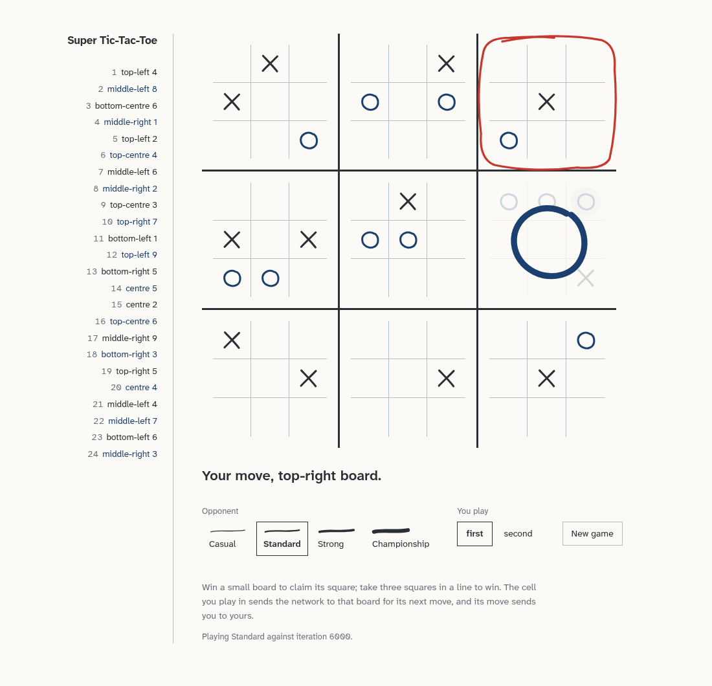

# Super Tic-Tac-Toe

Ultimate Tic-Tac-Toe against a neural network that taught itself the game
through self-play — playable in your browser from a single Docker container —
plus the training, search and evaluation pipeline that produced it.

<picture>
  <source media="(prefers-color-scheme: dark)" srcset="docs/images/board-dark.png">
  
</picture>

- **Play it** — one command, no GPU, no account, ~385 MB. [Jump to Quick start.](#quick-start)
- **Train and evaluate** — the self-play pipeline, native C++ search, and tournament tooling. [Jump to Development.](#development)

---

## Quick start

```bash
docker run -d --name sttt -p 8000:8000 --cpus 4 \
  ghcr.io/zamiul-rashid/super-tic-tac-toe:latest
```

Open <http://localhost:8000> and play. To reach it from another device on your
network, use this machine's address instead of `localhost`.

Take it down when you're done:

```bash
docker rm -f sttt                                          # stop and remove the container
docker rmi ghcr.io/zamiul-rashid/super-tic-tac-toe:latest  # (optional) delete the image too
```

### With Docker Compose

From a clone of this repository:

```bash
docker compose up -d      # start (pulls the published image)
docker compose logs -f    # watch the logs
docker compose down       # stop and remove
```

The root [compose.yaml](compose.yaml) is where the thread count and the game
cap live. Add `--rmi all` to `down` to delete the image as well.

### Build it yourself

```bash
docker compose -f docker/docker-compose.yml up --build
```

Compiles the native search, builds the React bundle, and packages the converted
network from [`models/`](models/). Nothing is pulled from a registry.

### Settings

Pass these with `-e` to `docker run`, or under `environment:` in compose.

| Variable | Default | What it does |
| --- | --- | --- |
| `STTT_WEB_THREADS` | `4` | Inference threads. **Set this** — left unset, ONNX Runtime takes every core. |
| `STTT_WEB_MAX_SESSIONS` | `8` | Games in progress before new ones are refused. |
| `STTT_WEB_SESSION_TTL` | `1800` | Seconds an idle game is kept. |
| `STTT_WEB_MODEL` | built-in `model-6000.onnx` | A different network to play (mount it; see [docs/web.md](docs/web.md)). |

### How strong is it?

Four opponents, all on CPU. Pick one in the page.

| Opponent | Search per move | Thinks for |
| --- | --- | --- |
| Casual | 128 simulations | ~30 ms |
| Standard | 512 simulations | ~100 ms |
| Strong | 2048 simulations | ~350 ms |
| Championship | 4096 simulations | ~600 ms |

**Standard** is the exact configuration the network won its championship at
against AlphaBeta, uttt.ai and OpenSpiel opponents — see the
[research report](docs/report/README.md).

### Worth knowing

- Refreshing the page keeps your game.
- There is **no login**. Run it on your own machine or a trusted network, and
  put a reverse proxy in front before exposing it to the internet.
- The image is linux/amd64 only.
- Everything else — the HTTP API, bringing your own checkpoint, how the image is
  built — is in [docs/web.md](docs/web.md).

---

## Development

### Set up

```bash
conda create -n sttt python=3.14 pip -y
conda activate sttt
python -m pip install -r requirements.txt
python -m pip install -e . --no-deps
make -C cpp                            # native search engine
python -m unittest discover -s tests   # 680+ tests
```

The original console game is available as `sttt` after installation.

### Train

Everything goes through two launchers. They take paths and settings as
arguments; a new checkpoint or output directory never needs a new script.

```bash
# Resume a checkpoint into a new run directory
scripts/train.sh \
  --checkpoint runs/source/latest.pt \
  --output runs/continuation \
  --iterations 1000 \
  --lr-horizon 5000

# Grand championship + AlphaBeta depth-10 sweep
scripts/evaluate.sh \
  --checkpoint runs/continuation/latest.pt \
  --output runs/continuation/evaluation
```

The training launcher freezes the source checkpoint before loading it, refuses
to write into an existing run, and defaults to CUDA, FP16, the native backend,
cosine learning-rate scheduling, population training and symmetry augmentation.

To bootstrap a fresh U-Net before online self-play:

```bash
python -m sttt.ai generate-dataset --output data/bootstrap --games 50000 --workers 8
python -m sttt.ai pretrain --dataset data/bootstrap --output runs/bootstrap --arch unet --fp16
scripts/train.sh --checkpoint runs/bootstrap/latest.pt --output runs/main
```

Details: [docs/training.md](docs/training.md) for the curriculum and checkpoint
rules, [scripts/README.md](scripts/README.md) for every launcher mode.

### Lower-level commands

```bash
python -m sttt.ai --help
python -m sttt.ai evaluate --checkpoint runs/main/latest.pt --games 20
python -m sttt.ai tournament --checkpoint runs/main/latest.pt \
  --opponents alphabeta tactical utttai --games 20
python -m sttt.visualize runs/main --output runs/main/charts
```

Ratings are local to the chosen pool, budgets and opening corpus; compare
checkpoints with mirrored openings and identical settings.

### Ship the network to the browser

The container serves the network through ONNX Runtime and carries no PyTorch.
Converting a checkpoint is one command, and it refuses to write anything unless
the exported network agrees with the original:

```bash
python scripts/export_onnx.py \
  --checkpoint runs/main/model-9000.pt \
  --output models/model-9000.onnx
```

---

## Repository layout

| Path | What's there |
| --- | --- |
| `sttt/` | Rules, search, training, evaluation, adapters |
| `sttt/web/` | The browser frontend's server: FastAPI, ONNX evaluator, game sessions |
| `frontend/` | The board UI (Vite + React) |
| `cpp/` | Native bitboard engine, MCTS and Python bindings |
| `docker/` | Dockerfile and build-from-source compose file |
| `models/` | Converted `.onnx` networks with provenance sidecars |
| `scripts/` | Launchers, the ONNX exporter, readiness and benchmark harnesses |
| `configs/` | Versioned training and web configuration |
| `engines/` | External-engine registry and wrappers |
| `tests/` | Unit, integration, adversarial, native and end-to-end tests |
| `docs/` | Documentation — start at [docs/README.md](docs/README.md) |
| `runs/`, `data/` | Generated checkpoints, metrics, datasets; ignored by Git |

## Documentation

- [Web frontend](docs/web.md) — running, configuring and building the container; the HTTP API
- [Research report](docs/report/README.md) — methodology, literature, measured results
- [Training and evaluation](docs/training.md)
- [Testing](docs/testing.md)
- [C++ engine design](docs/engineering/cpp-engine.md) and [benchmarks](docs/engineering/cpp-benchmarks.md)
- [External engines](engines/README.md)

Historical plans, handovers and readiness ledgers live in
[`docs/history/`](docs/history/); they explain how things got here and are not
operating instructions.
