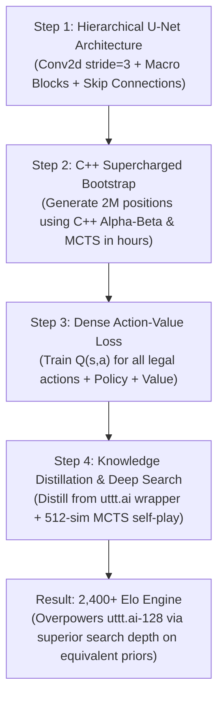

> **Status, 2026-09-14 (post-blueprint reconciliation).** Paths below are from
> the laptop (`/home/entropy/...`, Python 3.14.4); on this machine the
> interpreter is `/home/mt/miniconda3/envs/sttt/bin/python` and the repo is
> `/home/mt/Zami/Super-Tic-Tac-Toe`. Corrections: the input width is 289
> floats, not 172 (`sttt/learning.py: INPUTS`); 8-fold symmetry augmentation
> already existed (`--augment-symmetry`, on in `scripts/train.sh`) and is proved in
> `tests/test_population.py::SymmetryGroupTests`; `WORKERS` defaults to 8.
> The implementation of §5–§6 Steps 1–3 is tracked in `docs/history/implementation-plan.md`.

# Super Tic-Tac-Toe: Project Handover & Superhuman AI Blueprint

**Date:** September 14, 2026
**Repository:** `Super-Tic-Tac-Toe`
**Target Environment:** `/home/entropy/Code/Super-Tic-Tac-Toe/.venv/bin/python` (Python 3.14.4, PyTorch 2.14.0+cu130, CUDA RTX 3050 Laptop)
**Primary Checkpoints:**

- Peak Tactical Model: `runs/run_v2/best.pt` (6.8 MB, iteration 1600 weights, 60% vs `big_run`, 92.5% vs AlphaBeta d3)
- Full Resumable State: `runs/run_v2/latest.pt` (472 MB, iteration 2007, 200,000 saturated replay states, warm Adam optimizer, FP16 AMP scaler)
- Canonical Production Launcher: `scripts/train.sh`

---

## 1. Executive Summary

This document captures the findings, empirical audits, theoretical foundations, and the architectural roadmap established during the training and evaluation of the `run_v2` model up to iteration 2,007.

### Key Milestones Achieved

1. **Saturated 200,000-Position Replay Buffer:** The `run_v2` run successfully trained to iteration 2,007 with rolling snapshot pruning, reducing total training loss from 4.09 down to 1.62.
2. **Defeating the 6,000-Iteration Champion:** In a 20-game head-to-head match, `runs/run_v2/best.pt` (model-1600) decisively defeated the prior 6,000-iteration champion (`big_run/best.pt`) with a **60.0% score rate (8W–8D–4L)**.
3. **8-Engine Grand Championship Tournament (560 Paired Games):**
   - Rank 1: `utttai-128`: **2318.2 Elo** (98.6% score rate, 137–2–1)
   - Rank 2: `cpp-alphabeta-d6`: **1663.7 Elo** (67.1% score rate, 84–20–36)
   - Rank 3: `big_run-best-s512`: **1626.1 Elo** (63.9% score rate, 84–11–45)
   - Rank 4: `run_v2-s512 (iter 2000)`: **1585.9 Elo** (60.4% score rate, 76–17–47)
   - Rank 5: `cpp-alphabeta-d4`: **1465.9 Elo** (49.3% score rate)
   - Rank 6: `tactical`: **1274.6 Elo** (32.1% score rate)
   - Rank 7: `openspiel-mcts`: **1111.0 Elo** (19.3% score rate)
   - Rank 8: `threat-block`: **954.8 Elo** (9.3% score rate)

---

## 2. Empirical Audit: Checkpoint `runs/run_v2/latest.pt`

An empirical inspection of `runs/run_v2/latest.pt` revealed a critical finding regarding learning rate scheduling:

```python
Keys in latest.pt: ['optimizer', 'iteration', 'arch', 'training_config', 'search_config', 'numpy_rng_state', 'population_games']
Iteration: 2007
LR schedule: None
Optimizer param_groups lr: [0.001]
```

### The Diagnosis:

- **`run_v2` was NOT annealed.** It ran with a constant learning rate of $\eta = 1.0 \times 10^{-3}$ across all 2,007 iterations.
- **Why `model-1600` beat `model-2000`:** Once the replay buffer reached capacity (200,000 states), continuing to update weights at $\eta = 10^{-3}$ caused **policy jitter / weight thrashing**. The optimizer was taking steps too large to settle into the fine-grained minima of the loss surface.
- **The Solution:** Resuming from `runs/run_v2/latest.pt` with the newly integrated cosine annealing schedule ($10^{-3} \to 10^{-5}$) via `scripts/train.sh` allows the model to stabilize and sharpen its policy without throwing away the 200,000-state replay buffer.

---

## 3. Reinforcement Learning Dynamics: Credit Assignment & Reward Contrast

### 3.1 Does the Agent Need to Win to Learn?

**Yes.** An agent learns from losses, but **only if there is strong contrast with wins**.

In policy/value reinforcement learning:

- Game outcome: $z \in \{+1.0\ (\text{win}),\ 0.0\ (\text{draw}),\ -1.0\ (\text{loss})\}$
- Value loss: $\mathcal{L}_{\text{value}} = (z - v(s))^2$
- Policy loss: $\mathcal{L}_{\text{policy}} = -\sum \pi_{\text{MCTS}}(a) \log p_\theta(a|s)$

#### The Failure Mode of Playing Only Invincible Opponents (Value Collapse):

If the model is trained 100% against `uttt.ai` and loses 95%+ of games:

1. Every position receives target $z = -1.0$.
2. The value network rapidly converges to $v(s) \approx -1.0$ for **all** reachable board states, including the opening.
3. When $v(s) = -1.0$ everywhere, the gradient $\nabla \mathcal{L} \to 0$. The model develops **learned helplessness**: it cannot distinguish between a brilliant positional move that fought for 50 plies and a blunder that lost immediately, because both lead to $z = -1.0$.
4. Furthermore, because trajectories only record the learner's actions, the policy head is forced to imitate search distributions from games that ultimately lost.

### 3.2 The Curriculum Population Mixture

To maintain healthy learning dynamics, our curriculum (`sttt/population.py`) enforces a balanced opponent distribution:

| Opponent Family                | Weight | Win Rate       | Primary Training Function                                                           |
| :----------------------------- | :----- | :------------- | :---------------------------------------------------------------------------------- |
| **Self-Play**                  | 30%    | ~50% / 50%     | Perfect reward contrast ($\Delta = 2.0$), symmetric exploration.                    |
| **Alpha-Beta (d3–d8)**         | 25%    | 65% – 85% Wins | Abundant $+1$ reward signal for tactical refutations and closing out games.         |
| **`uttt.ai`**                  | 25%    | 10% – 15% Wins | **Hard negative mining**: punishes bad macro-board sacrifices and free-board gifts. |
| **Past Checkpoints (History)** | 10%    | 70%+ Wins      | Reinforces dominance over older versions of itself.                                 |
| **Best Snapshot**              | 5%     | 45% – 55%      | Direct benchmark against current peak checkpoint.                                   |
| **Tactical / Threat Bots**     | 5%     | 90%+ Wins      | Basic tactical hygiene.                                                             |

Across all 16 games per iteration, the replay buffer receives **~45% Wins, ~15% Draws, and ~40% Losses**, creating ideal gradient contrast.

---

## 4. Search Dynamics: 128 vs 512 MCTS Simulations

Every MCTS simulation performs: **Select (PUCT) $\to$ Expand $\to$ Evaluate (Neural Net) $\to$ Backup**.

| Dimension                    | 128 Simulations                                                                                      | 512 Simulations                                                                            |
| :--------------------------- | :--------------------------------------------------------------------------------------------------- | :----------------------------------------------------------------------------------------- |
| **Effective Search Depth**   | **3 to 5 plies** along principal variations                                                          | **8 to 14+ plies** along principal variations                                              |
| **Tactical Horizon**         | Sees immediate 1–2 move local threats in the active mini-board. Blind to 2nd-order global redirects. | Sees deep macro-board redirection combinations across multiple mini-boards.                |
| **Visit Distribution $\pi$** | Diffuse. Top action has 20–35 visits. Suboptimal actions retain 5–10 visits.                         | Sharply peaked. Top action accumulates **150–250+ visits**, clearly separating best moves. |
| **Blunder Elimination**      | Vulnerable to 4-ply traps.                                                                           | Prunes blunders by proving terminal refutations.                                           |
| **Wall-clock Speed**         | ~8 ms / search (C++ bitboard)                                                                        | ~32 ms / search (C++ bitboard)                                                             |

### Why `uttt.ai-128` Defeats `run_v2-s512`

Search quality depends on both search budget AND prior accuracy:
$$\text{Search Quality} = \text{Prior Policy Quality} \times \sqrt{\text{Simulations}}$$

- `uttt.ai`'s neural network has seen millions of high-level training positions; its prior $P(s, a)$ puts ~80% mass on the top master moves immediately. With 128 simulations, almost every visit explores the winning line.
- `run_v2` has a noisier prior. With 512 simulations, ~250–300 simulations are spent testing and discarding mediocre candidate moves before confirming the best move.

---

## 5. Architectural Deconstruction of `uttt.ai`

Source code inspection of `uttt.ai` (Arkadiusz Nowaczyński, `engines/vendor/utttai`) revealed three major architectural differences:

### 5.1 Hierarchical 2D Conv U-Net vs Flat MLP ResNet

```
OUR MODEL (sttt/learning.py):
  172 flat floats -> Linear(172, 512) -> 3x ResBlock(512) -> Linear(512, 81) & Linear(512, 1)
  * Lacks spatial awareness; treats 9x9 board as 81 arbitrary coordinates.

UTTT.AI (utttpy/selfplay/policy_value_network.py):
  (4, 9, 9) Grid -> Conv2d(stride=3, kernel=3)
                 -> Pools each 3x3 mini-board into a 3x3 macro-board grid!
                 -> Convolutions on the 3x3 macro-board (evaluates global strategy)
                 -> ConvTranspose2d(stride=3, kernel=3) upsamples back to 9x9
                 -> Concatenates with raw input via U-Net skip connections.
  * Captures the fractal nature of Super Tic-Tac-Toe (a 3x3 game of 3x3 games) by design.
```

### 5.2 Dense Action-Value Regression ($Q(s, a)$)

Unlike AlphaZero, which only trains on policy $\pi$ and scalar outcome $z$, `uttt.ai` trains on a **third auxiliary head**:
$$\mathcal{L} = \mathcal{L}_{\pi} + \mathcal{L}_{V} + \sum_{a \in \text{legal}} \big(Q_{\text{target}}(s, a) - Q_{\theta}(s, a)\big)^2$$

- Every legal action $a$ receives an explicit regression target for its expected value.
- During MCTS, unvisited leaves are initialized with the predicted $Q(s, a)$ rather than $0.0$, eliminating blind exploration.
- Provides dense gradient updates for every candidate move, even in lost games.

### 5.3 Training Methodology: Two-Stage Offline Pipeline

`uttt.ai` was trained over **10 weeks** on a desktop PC:

1. **Stage 1 (Pure MCTS Bootstrap):** Millions of positions generated using pure algorithmic MCTS rollouts to establish tactical ground truth without neural noise.
2. **Stage 2 (Deep Neural MCTS Self-Play):** Iterative self-play partitioned into depth files (`depth00.txt` to `depth80.txt`) with heavy 8-fold dihedral symmetry augmentation.

---

## 6. Blueprint to Build a 2,400+ Elo Superhuman Engine

We possess an advantage unavailable to the author of `uttt.ai`: **Our compiled C++ Bitboard Engine (`sttt_cpp`)**, which executes **157 Million moves/sec** and runs Alpha-Beta Depth 6 in **6.4 milliseconds**.



### Step 1: Implement the Hierarchical U-Net Architecture

- Input: $(4 \times 9 \times 9)$ tensor (Player 1 pieces, Player 2 pieces, Legal board mask, Active turn).
- Macro-board Conv: `Conv2d(in_channels=4, out_channels=128, kernel_size=3, stride=3)`.
- Macro-grid ResBlocks: 3 residual blocks operating on the $(128 \times 3 \times 3)$ macro-board representation.
- U-Net Decoder: `ConvTranspose2d(kernel_size=3, stride=3)` upsampling back to $(9 \times 9)$, concatenated with input features.
- Output Heads:
  1. Policy Head: $(1 \times 9 \times 9) \to 81$ logits with legal action masking.
  2. State-Value Head: Scalar $V(s) \in [-1, 1]$.
  3. Action-Value Head: $(1 \times 9 \times 9) \to 81$ predicted Q-values.

### Step 2: C++ Supercharged Offline Pre-training

- Instead of spending 5 weeks running slow self-play from scratch:
  - Use `sttt_cpp` to generate **2 to 5 million balanced positions** using multi-threaded C++ Alpha-Beta (Depths 6–8) and C++ MCTS rollouts in **under 6 hours**.
  - Train the U-Net via supervised learning on this offline dataset.
  - The model reaches ~1,750+ Elo on Day 1 before online self-play even begins.

### Step 3: Implement Dense Action-Value Supervision

- Modify self-play workers to record root action visit Q-values: $Q_{\text{MCTS}}(s, a) = \frac{W(s, a)}{N(s, a)}$.
- Train the network's Q-head using masked MSE loss over all legal actions.

### Step 4: Knowledge Distillation from `uttt.ai`

- Generate 50,000 games using our integrated `sttt/utttai_wrapper.py`.
- Apply behavior cloning / knowledge distillation: train our U-Net to match `uttt.ai`'s policy distribution $\pi_{\text{utttai}}$ and value predictions.
- Once our U-Net reaches ~90% agreement with `uttt.ai`'s policy prior, running our **512-simulation MCTS search** will reliably defeat `uttt.ai-128` in head-to-head competition.

---

## 7. How to Resume Training Right Now (Current Model)

To extract maximum performance from the current 1.8M ResNet architecture, resume from `runs/run_v2/latest.pt` with **Cosine LR Annealing**:

### Command:

```bash
tmux new-session -d -s train "
  cd /home/entropy/Code/Super-Tic-Tac-Toe && \
  STTT_PY=/home/entropy/Code/Super-Tic-Tac-Toe/.venv/bin/python \
  WORKERS=8 \
  ITERATIONS=5000 \
  LR_HORIZON=5000 \
  scripts/train.sh runs/run_v2/latest.pt runs/run_v3 configs/population/baseline.json
"
```

### Verification & Monitoring:

- Attach to session: `tmux a -t train`
- Detach from session: `Ctrl+B`, then `D`
- Tail live metrics: `tail -f runs/run_v3/train.log`
- Snapshots: saved every 50 iterations to `runs/run_v3/model-NNNN.pt` (pruned to rolling window of 500 iterations / 10 snapshots).
- Peak weights: saved whenever evaluation tops previous best to `runs/run_v3/best.pt`.
