# Hierarchical Neural Search and Population Training for Ultimate Tic-Tac-Toe

### An implementation study with reproducible local evaluation

**Project:** Super Tic-Tac-Toe  
**Report date:** 18 September 2026  
**Status:** Engineering research report; not a peer-reviewed publication  
**Evidence cutoff:** Archived evaluation at iteration 4193 (Sections 7–8.3); expanded evaluation added at iteration 4530 with an enlarged 8-entrant roster (Section 8.4). Later training beyond 4530 is outside this report.  
**Code inspected:** `feb5982c4d40a0500f0e1496d365b2b2b920a011` (archived evidence); the iteration-4530 evaluation ran with native build `f770ec7`, an earlier commit — see [EVIDENCE.md](EVIDENCE.md#new-evidence-iteration-4530-evaluation)  
**Authors and affiliations:** To be supplied by the project contributors before external submission.

## Abstract

Ultimate Tic-Tac-Toe couples local tactical decisions with global strategic constraints: a move selects both a cell and the sub-board in which the opponent must respond. This report describes an implemented learning and search system that represents these two scales explicitly. A 1,560,835-parameter convolutional encoder–decoder maps a canonical state representation to policy, state-value, and auxiliary action-value predictions. Batched prior-guided Monte Carlo tree search generates learning targets; a quota-controlled population supplies self-play, classical search, historical networks, and external opponents. A C++ bitboard engine accelerates game operations and search, while spawned CPU workers share a single neural inference owner. The system also implements supervised bootstrap training, resumable optimization, and paired evaluation with frozen checkpoint inputs.

We audit saved experiments rather than claim new experiments were conducted for this report. At iteration 4193, the agent obtains 97 wins, 14 draws, and 9 losses in its 120 games within a seven-player, 420-game round robin. Its score against the integrated uttt.ai stage-2 model at 128 simulations is 35%, despite using 512 simulations itself. In a separate 20-game comparison with a depth-10, 50-million-node-cap AlphaBeta opponent, its score is 65%, with a 95% opening-pair bootstrap interval of 50–80%. A later checkpoint, iteration 4530, was subsequently evaluated in a larger 8-entrant, 2,016-game championship (Section 8.4): it places second by score (85.8%) behind the integrated uttt.ai (91.3%), with a 9–41–22 record and a 41.0% pair-score against uttt.ai specifically; a follow-up 20-game check at 2,000 simulations against uttt.ai scores 40.0% and is too small to say whether the higher simulation budget changes anything. That championship ran concurrently with training under reduced CPU priority and used unequal per-entrant compute budgets throughout, so none of iteration 4530's numbers are directly comparable to iteration 4193's on either axis. Collectively, these findings support strong performance against the tested local baselines, while identifying a persistent gap to uttt.ai across both evaluated checkpoints. They do not establish state-of-the-art strength, equal-compute superiority, or the causal benefit of individual components.

**Keywords:** Ultimate Tic-Tac-Toe; Monte Carlo tree search; policy–value network; population training; native search; reproducible evaluation.

## Reading guide

Sections 1–3 explain the problem and prior work; Sections 4–6 describe the implementation; Sections 7–9 present evidence and limitations. Section 8.4 adds the newer, separately-provenanced iteration-4530 evaluation next to the archived iteration-4193 results in Sections 8.1–8.3. Section 10 explains reproduction and maps the paper back to the repository. The companion [evidence guide](EVIDENCE.md) records data selection, provenance, figure generation, and image prompts, including a [dedicated provenance section](EVIDENCE.md#new-evidence-iteration-4530-evaluation) for the iteration-4530 evidence. The existing [training guide](../training.md), [testing guide](../testing.md), and [engine guide](../../engines/README.md) remain the operational documentation.

## 1. Introduction and problem statement

Ordinary Tic-Tac-Toe is a small local placement game. Ultimate Tic-Tac-Toe nests nine such boards inside a larger 3×3 board. Winning a local board claims one position on the macro-board; claiming a macro-board line wins the game. The unusual constraint is that the local cell chosen on one move determines the opponent's next sub-board. Consequently, a locally attractive move may send the opponent into an immediately winning position elsewhere. The learning problem is to evaluate these coupled consequences without expanding every possible continuation.

The implementation uses the **closed completed-board variant**: won or drawn sub-boards cannot receive further moves. If a move directs the opponent to a closed sub-board, the opponent may choose any open sub-board. A drawn local board does not count as a win for either player. The game ends when a player wins a macro-board line or all local boards are closed. These are the rules implemented in [`State`](../../sttt/env.py), and they define the task throughout this report.

Let a state be $s=(C,B,t,f,r)$, where $C$ contains 81 cell occupancies, $B$ contains nine local-board outcomes, $t\in\{-1,+1\}$ is the player to move, $f\in\{-1,0,\ldots,8\}$ identifies the forced board or free choice, and $r$ is the terminal result, if any. An action is $a=9b+c$, with board index $b$ and local cell index $c$. Only empty cells on permitted open boards belong to the legal action set $\mathcal A(s)$. Terminal payoffs are $+1$, $0$, and $-1$ for a win, draw, and loss from the selected player's perspective.

The practical objective is to train a useful local game-playing agent under bounded search and hardware resources while preserving trustworthy evaluation. Four engineering questions follow:

1. How should a network represent both local cells and macro-board structure?
2. How can search improve move selection and produce targets for learning?
3. How can training cover diverse opponents without silently changing its curriculum?
4. How can checkpoint strength be measured without confusing search budget, opening selection, or integration failures with learning progress?

## 2. Scope and contributions

The contribution is an integrated, inspectable implementation rather than a claim to a new reinforcement-learning algorithm. The repository combines:

- A hierarchical convolutional policy–value network with an auxiliary action-value head and a shared state encoding across Python and C++.
- Batched PUCT search with subtree reuse, exact terminal-proof propagation, and reversible reduction of exploration toward weak-looking branches.
- Native rules and search, process-based game generation, and a central inference service that can run on CPU or CUDA.
- Search-generated bootstrap data and online training against an explicitly configured opponent population.
- Checkpoint freezing, mirrored seat assignments, per-game records, and opening-pair uncertainty estimates.

Several ingredients deliberately follow existing work. In particular, the board-aware stride-3 design and auxiliary action-value learning are influenced by uttt.ai; search-guided policy/value learning follows the AlphaZero family. Distinguishing implementation work from algorithmic novelty is essential to an accurate account.

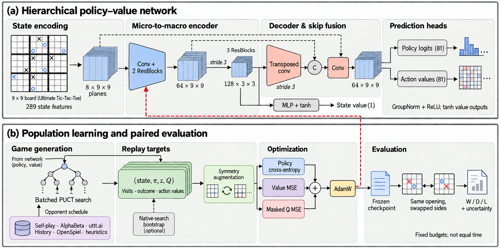

*Figure 1. System methodology. Panel (a) summarizes micro-to-macro reasoning and the policy, action-value, and state-value outputs. Panel (b) connects game generation to replay, optimization, checkpointing, and evaluation. The two skip paths supply micro features and input planes to the decoder's fusion operation. The feature bars and board examples are schematic, not measurements. This illustration was generated with the requested imagegen workflow using the supplied academic figure as a style reference; the exact tensor specification is given in Table 2.*

## 3. Literature review and existing solutions

### 3.1 Classical search and Monte Carlo planning

AlphaBeta pruning accelerates minimax search by omitting branches that cannot alter the current backed-up decision. Its efficiency depends on move ordering and the structure of the searched tree. A depth-limited implementation still depends on its evaluation function at the frontier; a depth cap is not proof that a game has been solved. Here AlphaBeta supplies both a training opponent and a reference at explicit depth/node limits. [Knuth and Moore, 1975](https://www.sciencedirect.com/science/article/pii/0004370275900193).

UCT applies bandit-style selection to Monte Carlo tree planning, balancing exploitation and exploration. It provides a useful conceptual starting point for search that allocates simulations adaptively. Our neural search uses a policy-prior exploration term, whereas the selected OpenSpiel baseline uses rollout evaluation; they should not be described as identical search algorithms with interchangeable simulation counts. [Kocsis and Szepesvári, 2006](https://aima.cs.berkeley.edu/~russell/classes/cs294/s11/readings/Kocsis%2BSzepesvari:2006.pdf).

### 3.2 AlphaZero-style policy improvement

AlphaZero established a general recipe in which a neural policy and value guide search, and self-play supplies subsequent training data. The relevant connection is iterative improvement between a learned evaluator and a stronger search policy. Our implementation adopts that family of ideas but incorporates handcrafted bootstrap search, a heterogeneous opponent population, an auxiliary Q objective, and local engineering choices. It is not a reproduction of AlphaZero's compute regime or reported results. [Silver et al., 2017](https://arxiv.org/abs/1712.01815).

### 3.3 Hierarchical convolutional models

U-Net introduced a contracting and expanding architecture for spatial prediction. Here the name describes a compact encoder–decoder adapted to the board's 9×9 and 3×3 scales, not a biomedical segmentation model. Residual blocks support repeated transformations without discarding their input features. Group normalization avoids dependence on batch-wide running statistics, which is useful when the same network serves small search requests and larger optimizer batches. These are design rationales; this report contains no normalization or architecture ablation demonstrating that these choices improve game strength. [Ronneberger et al., 2015](https://arxiv.org/abs/1505.04597); [He et al., 2015](https://arxiv.org/abs/1512.03385); [Wu and He, 2018](https://arxiv.org/abs/1803.08494).

### 3.4 uttt.ai

Arno Waczynski's uttt.ai is an AlphaZero-like Ultimate Tic-Tac-Toe system with a browser interface and a published neural-search implementation. Its documented procedure uses an initial MCTS-generated dataset followed by neural-search data. The project describes masked policy learning, an auxiliary action-value objective, and a state-value target based on search estimates. Its published evaluation uses its own hardware, opponents, and budgets; those results cannot be transplanted into this repository's leaderboard. [uttt.ai upstream project](https://github.com/arnowaczynski/utttai).

Our repository vendors the Python reference at revision `622dae66b18198f6f12aef0a0bccd5bd40de2d8e` and uses the deployed stage-2 ONNX model through a persistent process adapter. The upstream Apache-2.0 license and provenance are preserved. The local adapter uses CPU inference, exploration strength 2.0, and a fresh search root per move. The tested `utttai-128` entrant is this specific integration at 128 simulations, not a measurement of every mode available in the upstream browser. See [vendored provenance](../../engines/vendor/utttai/PROVENANCE.md) and [adapter source](../../sttt/utttai_wrapper.py).

### 3.5 Google DeepMind OpenSpiel

OpenSpiel is a general research framework containing game environments, search algorithms, and reinforcement-learning tools. It is not one trained Ultimate Tic-Tac-Toe agent. Its scope spans multiple information structures and game types. Our use of it is much narrower: the official compiled Ultimate Tic-Tac-Toe environment plus Python MCTS with a random-rollout evaluator. A result against that configuration says nothing about all algorithms or agents that could be built with OpenSpiel. [Lanctot et al., 2019](https://arxiv.org/abs/1908.09453); [OpenSpiel overview](https://openspiel.readthedocs.io/en/latest/intro.html).

The upstream game represents a free-choice turn as a board-selection decision followed by a cell-selection decision. Our adapter translates a local action into those steps and synchronizes opening and opponent moves. Thus the configured 100 simulations are **per OpenSpiel decision**, and a free-choice turn may involve two searches. It uses `RandomRolloutEvaluator(1)` and `solve=True`. Old repository experiments involving a Python substitute are excluded from this report. [Upstream game source](https://github.com/google-deepmind/open_spiel/blob/master/open_spiel/games/ultimate_tic_tac_toe/ultimate_tic_tac_toe.cc); [upstream MCTS](https://github.com/google-deepmind/open_spiel/blob/master/open_spiel/python/algorithms/mcts.py); [local adapter](../../sttt/bots.py).

### 3.6 What differs in this implementation?

**Table 1. Scope and mechanism comparison.** The uttt.ai column describes the pinned source and local integration; the OpenSpiel column describes only the selected baseline. Architectural differences are not evidence of superior strength.

| Dimension | This repository | Integrated uttt.ai | Selected OpenSpiel baseline |
| --- | --- | --- | --- |
| Primary role here | Trainable local agent and experiment pipeline | Published external neural-search opponent | General framework used as a rollout-search opponent |
| Network input | 289 canonical features reshaped into eight spatial planes | Four spatial input planes in the vendored network | No learned network in this configuration |
| Representation | 64-channel micro features, 128-channel macro features, residual blocks, skip fusion | Board-aware encoder/decoder with its own widths and blocks | Official game state and rollout evaluator |
| Normalization | GroupNorm | BatchNorm in the vendored network | Not applicable |
| State-value target | Final game outcome from the state's player perspective | Search-derived state-value targets in upstream training code | Rollout returns |
| Auxiliary supervision | Visited-action Q regression | Action-value learning in upstream training | None in this configuration |
| Online curriculum | Quota-controlled mixed population | Frozen stage-2 opponent here | No online learning here |
| Search integration | Native/Python PUCT; batching and retained subtrees | Published NMCTS; fresh root per local adapter move | UCT-style MCTS, random rollouts, solved-node handling |
| Budget in championship | 512 simulations per search request | 128 simulations per move | 100 simulations per board/cell decision |
| User interface at report time | CLI and report tooling | Upstream browser application | Framework APIs |

The upstream tensor and loss details can be checked directly in the pinned [network](../../engines/vendor/utttai/utttpy/selfplay/policy_value_network.py) and [loss](../../engines/vendor/utttai/utttpy/selfplay/policy_value_loss.py) source. The specialization here is the particular combination of representation, search infrastructure, resumable population training, and auditable experiment tooling.

## 4. State representation and network architecture

### 4.1 Canonical encoding

The encoder expresses the position relative to the player to move:

$$d = 81\times3 + 9\times4 + 10 = 289.$$

The cell channels indicate empty, mine, and theirs. Four board-status channels indicate open, mine, theirs, and drawn. The final ten features encode either unrestricted board choice or one of nine forced boards. This perspective convention lets one model serve both players without learning separate color-specific values. Legal moves are represented separately by an 81-element Boolean mask. See [`learning.encode`](../../sttt/learning.py).

The network converts the flat vector into eight 9×9 planes: three cell planes, four broadcast board-status planes, and one forced-board plane. A forced board activates its 3×3 region; free choice activates the whole plane. Action ordering remains board-major, so outputs are permuted back from spatial raster order to the shared 81-action representation.

### 4.2 Micro-to-macro-to-micro computation

**Table 2. Default U-Net configuration**, directly derived from [`sttt/unet.py`](../../sttt/unet.py). Shapes omit the batch dimension.

| Stage | Operation | Output shape |
| --- | --- | --- |
| Input | Reshape/broadcast canonical encoding | $8\times9\times9$ |
| Stem | 3×3 convolution, GroupNorm(8), ReLU | $64\times9\times9$ |
| Micro reasoning | Two residual convolutional blocks | $64\times9\times9$ |
| Board aggregation | 3×3 convolution with stride 3, GroupNorm, ReLU | $128\times3\times3$ |
| Macro reasoning | Three residual convolutional blocks | $128\times3\times3$ |
| Upsampling | 3×3 transposed convolution with stride 3, GroupNorm, ReLU | $64\times9\times9$ |
| Fusion input | Concatenate micro features, upsampled features, and input planes | $136\times9\times9$ |
| Fusion output | 3×3 convolution, GroupNorm, ReLU | $64\times9\times9$ |
| Policy head | 1×1 convolution and action permutation | 81 logits |
| Action-value head | 1×1 convolution, permutation, tanh | 81 values |
| State-value head | Flatten macro features; linear 1152→256→1; ReLU then tanh | One value |

The default network contains **1,560,835 trainable parameters**, also recorded in the training logs. Its stride-3 aggregation aligns each local board with one macro location. The decoder combines global context with local detail so that the policy still selects individual cells. The value head reads the macro representation before decoding. The Q head supplies an auxiliary learning objective; the standard inference interface returns policy and state value, so it is inaccurate to describe normal move selection as simply taking the largest predicted Q value.

The repository also supports an MLP and a fully connected residual network. Their presence offers an ablation path, but the evaluated checkpoints in this report are U-Nets; no controlled MLP-versus-U-Net conclusion is available from these results.

## 5. Search and learning methodology

### 5.1 Prior-guided tree search

Search retains visit counts, accumulated values, priors, and optional solved outcomes. Its base selection rule has the PUCT form

$$a^* = \arg\max_{a\in\mathcal A(s)}\left[Q(s,a)+c_{\mathrm{puct}}P(s,a)\frac{\sqrt{N(s)+1}}{1+N(s,a)}\right].$$

The implementation extends this expression with in-flight accounting for batched leaf evaluation and a soft exploration weight. Values use the player-to-move perspective; backing up through alternating turns changes their sign. Legal actions are masked before neural probabilities are used. During training, root priors are mixed with Dirichlet noise, and early moves are sampled from the search distribution; later moves select its maximum. The current defaults use $c_{\mathrm{puct}}=1.5$, Dirichlet concentration 0.3, and 25% root-noise mixing. See [Python search](../../sttt/search.py), [native MCTS](../../cpp/src/mcts.cpp), and [self-play](../../sttt/selfplay.py).

Subtree reuse retains the branch reached after a move and can reduce repeated work on later turns. Therefore a request for 512 simulations does not necessarily describe 512 entirely fresh visits in an empty tree. Proof propagation is restricted to terminal outcomes and logical propagation through children: a neural prediction is not a proof. A proven root can stop search early. Soft pruning downweights exploration of sufficiently visited, lower-valued branches and periodically revisits neglected choices; it does not certify those branches as losing.

### 5.2 Bootstrap before online learning

[`sttt/bootstrap.py`](../../sttt/bootstrap.py) implements a three-stage path:

1. Generate games using model-free native MCTS, optionally against native AlphaBeta opponents.
2. Save state encodings, search policies, legal masks, final outcomes, visited-action values, and provenance in dataset shards.
3. Fit a fresh network and emit a checkpoint containing weights, optimizer state, and warm replay for the online trainer.

The current pretrainer supports game-phase-stratified sampling, symmetry augmentation, AdamW, mixed precision, linear learning-rate warm-up, and cosine decay. The inspected pretraining log records ten epochs, 9,570 optimizer steps, a 100-step warm-up, and a learning rate that decays from $3\times10^{-4}$ to $10^{-5}$. The run directory is named `unet-bootstrap-100k`; that name alone is **not** used as evidence that precisely 100,000 games generated its dataset. Likewise, the available logs do not constitute a complete cryptographic lineage from that pretraining run through every early online checkpoint.

### 5.3 Population training

Each online iteration schedules a batch of games, collects search targets, appends replay rows, performs optimizer updates, and saves resumable state. The selected baseline curriculum is specified in [`configs/population/baseline.json`](../../configs/population/baseline.json).

**Table 3. Configured games per 100 scheduled games.** Quotas continue across iteration boundaries rather than being independently rounded in each 16-game iteration.

| Family | Quota | Budget or role |
| --- | ---: | --- |
| Self-play | 30 | Learner search on both sides |
| uttt.ai | 25 | 64 / 128 / 256 simulations |
| AlphaBeta | 25 | Depth 4–8; 100k / 250k / 500k node caps |
| Historical networks | 10 | 128 / 256 / 512 simulations |
| Best-checkpoint slot | 5 | Historical/best reference; not automatic promotion |
| Tactical variants | 2 | Limited tactical search |
| OpenSpiel | 1 | 128 / 256 / 512 / 1024 simulations per decision |
| Threat/blocking | 1 | Defensive tactical variation |
| Behavioral styles | 1 | Simple policies with bounded noise |

Configured families, requested families, and actual families are not always identical. For example, historical slots can resolve to self-play when no snapshot is available, and a best slot can use a historical model. The trainer logs these distinctions and stores the population cursor and configuration hash. In opponent games it records learner positions; in self-play it records both sides. Consequently, a percentage of games is not the same as a percentage of replay positions or sampled optimizer examples.

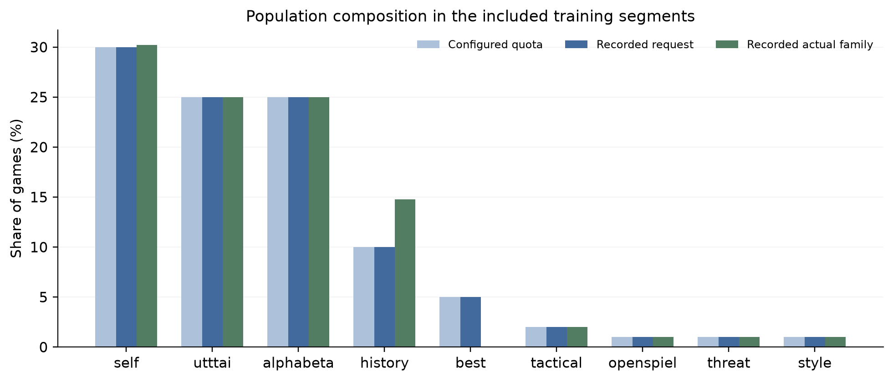

*Figure 2. Population composition across iterations 187–4193. Bars distinguish configuration quotas from recorded requests and actual opponent families. These are game shares, not replay-position shares. Differences reflect actual scheduler resolution, including historical/best slots; they should not be hidden by reporting only the configuration.*

### 5.4 Training objectives

For a replay sample, let $\pi$ be the search policy, $z$ the final outcome from the state's player perspective, $q_a$ a backed-up root-child value, and $m_a^Q$ indicate a visited or proven action with a Q target. The model predicts masked policy $p_\theta$, state value $v_\theta$, and auxiliary action values $\hat q_\theta$. For a minibatch of size $B$, the implemented objective is

$$\mathcal L_\pi=-\frac1B\sum_{i=1}^B\sum_{a\in\mathcal A(s_i)}\pi_{i,a}\log p_\theta(a\mid s_i),$$

$$\mathcal L_v=\frac1B\sum_{i=1}^B(v_\theta(s_i)-z_i)^2,$$

$$\mathcal L_Q=\frac{\sum_{i,a}m^Q_{i,a}(\hat q_\theta(s_i,a)-q_{i,a})^2}{\sum_{i,a}m^Q_{i,a}},\qquad
\mathcal L=\mathcal L_\pi+\mathcal L_v+\mathcal L_Q.$$

If no Q targets are present, the Q term is omitted. It is normalized by the number of available action targets, not by all 81 actions. The outcome target uses $z=r\,t$; the Q target comes from root-child search statistics with the appropriate perspective conversion. AdamW applies its weight decay separately from the explicit loss expression. The online trainer checks finite loss and clips the gradient norm at 1.0. See [`policy_value_loss`](../../sttt/learning.py) and [`root_action_values`](../../sttt/search.py).

Symmetry augmentation transforms the state, policy, legal mask, Q values, and Q mask consistently under board rotations/reflections. Although stratified replay is implemented, the included online logs explicitly report **uniform** replay sampling. It would be incorrect to attribute these particular online results to stratified sampling merely because the option exists.

## 6. Systems implementation

### 6.1 Native rules and search

The native engine stores local occupancies in compact bitboards and uses lookup-based line detection. Its packed `BoardState` has a compile-time asserted size of 46 bytes. This is the native structure size, not the total Python object size or the memory consumed by a search tree. The engine supports legal move generation, transitions, encoding, AlphaBeta, and MCTS through bindings used by the Python orchestration layer. See [core engine](../../cpp/include/sttt_core.hpp) and [binding adapter](../../sttt/cpp_env.py).

Performance claims require separating primitive kernels, rollout-only search, dummy neural callbacks, and real network inference. The [corrected native benchmark report](../engineering/cpp-benchmarks.md) explicitly revises earlier fixed-state encoding measurements and distinguishes these workloads. Its large primitive speedups are not presented here as equivalent end-to-end U-Net training speedups. This report does not re-run those historical benchmarks.

### 6.2 Parallel generation with centralized inference

Workers are created with multiprocessing `spawn`. They own search trees and game state, while the parent process batches inference requests and owns the model. The model stays fixed during the game-generation phase; optimization starts after the iteration's games finish. This avoids describing the implemented system as an asynchronous actor–learner architecture with continuously changing weights.

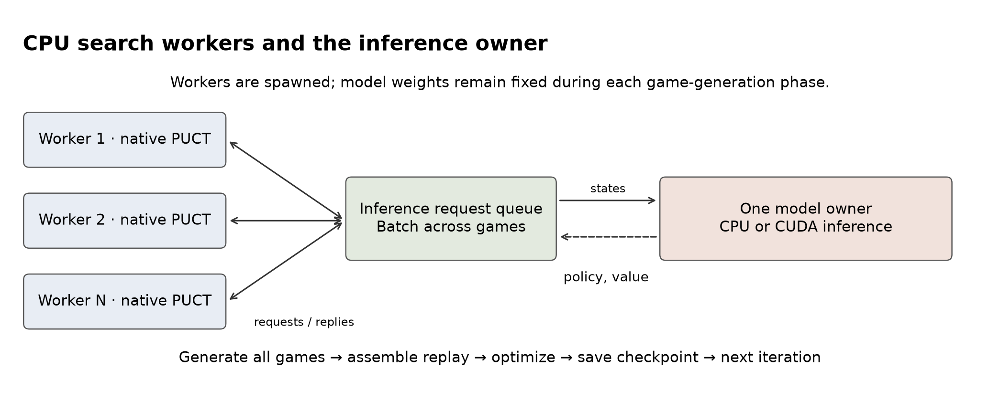

*Figure 3. Inference ownership and iteration phases. Search runs in CPU workers; the inference owner may use CPU or CUDA. Inference time is part of the self-play phase and must not be added to self-play wall time as though it were a separate sequential stage. Worker times can overlap.*

The inspected training logs report eight workers, a native backend, CUDA mixed precision, 16 games per iteration, 512 requested simulations, leaf batches of 64, and a 200,000-position replay buffer. The championship evaluates neural inference on CPU in FP32 with leaf batches of 16. Training and evaluation throughput are therefore different quantities.

### 6.3 Resume state and provenance

Full online checkpoints include model and optimizer state, replay data, RNG state, scaler state, learning-rate schedule state, population cursor, and configuration metadata. Small `model-*.pt` snapshots are retained for opponents and evaluations. A weights-only snapshot is not equivalent to a full continuation checkpoint. Writes use a temporary file followed by replacement to reduce the risk of partially written checkpoints.

The generalized launchers freeze checkpoint inputs and take paths as arguments. Evaluation manifests record hashes, settings, environment information, and per-game output locations. The saved experiment manifests reference an older script name, `run_thorough_tournament.py`; the current equivalent is [`scripts/evaluation_suite.py`](../../scripts/evaluation_suite.py), normally invoked through `evaluate.sh`. The archived command line is retained as historical evidence rather than rewritten to look current.

### 6.4 Optional opponent adaptation

[`sttt/opponent.py`](../../sttt/opponent.py) implements a persistent mixture over random, center, corner, local-win, and global-win behavioral policies. Observed moves update log weights; the mixture's contribution is conservatively capped. Search can use that profile at opponent nodes, and minimax proof handling changes when an explicitly fallible opponent model is active. This is an implemented optional feature, but the championships in this report do not evaluate personalized human adaptation. Broader claims in the [adaptive-agent research document](../research/adaptive-agent.md) remain research direction, not established results here.

## 7. Experimental design and evidence

### 7.1 Frozen artifacts

The archived evidence in this section and in Sections 8.1–8.3 uses two completed championships and two completed depth-10 match sets, both against checkpoints at or before iteration 4193. Each championship contains seven entrants, 21 matchups, and 20 games per matchup, for 420 games total. Each candidate therefore plays 120 championship games. The depth-10 experiment adds 20 games per checkpoint and is **separate from** the round robin. A newer, separately provenanced championship and spot check against checkpoint iteration 4530 are described in Section 8.4 and are not part of the counts in this subsection.

**Table 4. Evaluated checkpoint identity and settings.** Complete hashes and manifests are preserved in [the evidence snapshot](evidence/snapshot.json).

| Property | Earlier checkpoint | Later checkpoint |
| --- | --- | --- |
| Iteration | 1806 | 4193 |
| SHA-256 prefix | `228830ff` | `562510ec` |
| Architecture | U-Net | U-Net |
| Learner search budget | 512 | 512 |
| Inference | CPU / FP32 | CPU / FP32 |
| Requested backend | `auto`, native extension available | `auto`, native extension available |
| Leaf batch | 16 | 16 |
| Base opening seed | 4242 | 4242 |
| Opening length | Two plies | Two plies |
| Games per matchup | 20 | 20 |
| Depth-10 opponent | Depth cap 10; node cap 50,000,000 | Same |

The later manifests record Python 3.14.6, PyTorch 2.14.0+cu130, and native build `20260913125605_b90d928`. CUDA availability in that manifest does not imply that the CPU evaluation used the GPU. The manifests do not preserve a complete per-entrant hardware/runtime attestation, so exact cross-machine timing reproduction is not guaranteed. The native build revision also differs from the code revision inspected for this report.

The championship's AlphaBeta d4 and d6 constructors use a 50-million-node default cap in the inspected harness. OpenSpiel uses 100 simulations per decision, and uttt.ai uses 128 per move. Their settings are recoverable from entrant names and implementation defaults, but historical manifests do not independently pin every external dependency and resolved entrant configuration. This is a provenance limitation to improve in future runs.

### 7.2 Pairing and statistics

For each opening pair, the same board position is played with the agents' seats exchanged. This is seat mirroring, not necessarily a geometric board reflection. The tournament derives a deterministic seed for each matchup from the base seed; it does not use one identical opening corpus for all different opponents. The two reported championships retain the same entrant order and base settings. Each depth-10 run uses its own shared opening corpus at seed 4242.

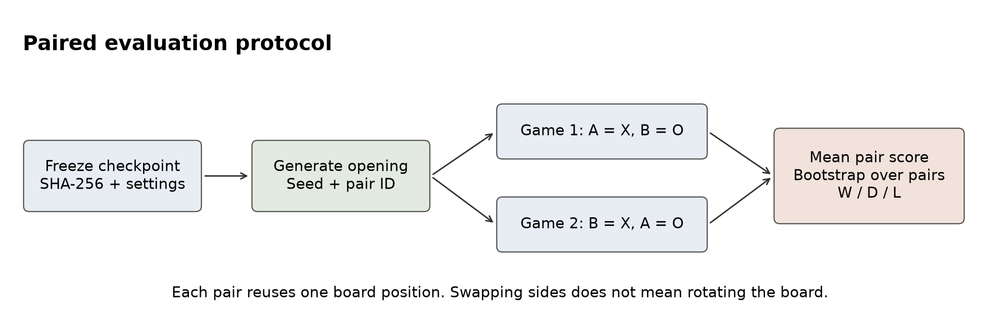

*Figure 4. Evaluation methodology. The independent resampling unit is the opening pair. Retaining the pair prevents treating the two seat-swapped games as unrelated samples.*

Define a game's score as $y\in\{1,\tfrac12,0\}$ for win, draw, or loss. The aggregate score is

$$\hat S=\frac{W+\tfrac12D}{W+D+L}.$$

For pair $j$, average the two game scores, $\bar y_j=(y_{j,1}+y_{j,2})/2$. The report resamples the ten pair means with replacement 10,000 times using seed 4243 and reports the 2.5th and 97.5th percentiles. Saved depth-10 intervals are independently reproduced from the bundled game rows. Championship intervals are report-derived using the same procedure.

A perfect observed score yields a degenerate empirical bootstrap interval when all pair scores equal one. This is a limitation of resampling a small, uniform sample, **not certainty of winning every future game**. Repeated use of one small opening corpus also limits generalization. Rankings and ratings summarize this selected pool and should not be called universal Elo ratings.

### 7.3 Training-log selection

We include 4,007 full training records spanning iterations 187–4193 from two contiguous segments. They describe 64,112 scheduled games, not the entire project training history and not necessarily 64,112 distinct board trajectories. Thirteen additional records contain periodic evaluation overhead; they are separated from training rows. No duplicate full training records occur in the selected segments. Earlier iterations, unrecorded costs, and the ongoing continuation after 4193 are not included in the learning curves.

For plots, thin lines show raw measurements and heavy lines show a 100-iteration trailing mean. The median recorded training-iteration duration is 19.41 seconds. That duration excludes the separately logged periodic evaluation overhead and cannot be multiplied by the final iteration to claim a precise total training budget. The source files and hashes, selection settings, normalized rows, and game records are bundled with the report.

## 8. Results

### 8.1 Bootstrap fitting and online dynamics

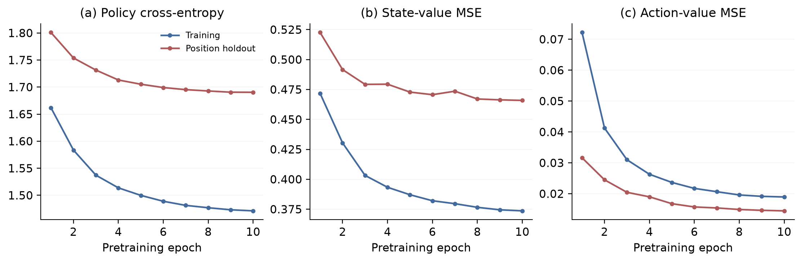

*Figure 5. Saved pretraining losses. The holdout is formed by splitting positions, not entire games. Adjacent positions from one trajectory may occur on both sides of the split, so these curves measure fitting on a position holdout, not independently established game-level generalization.*

The pretraining policy loss decreases from 1.662 to 1.471, while its holdout counterpart decreases from 1.801 to 1.690. State-value holdout MSE changes from 0.523 to 0.466, and holdout Q MSE from 0.0316 to 0.0145. These trends show that the model fits the stored targets; playing strength still requires match evaluation. Training and holdout Q losses also aggregate masked targets differently across the logged training steps and validation pass, so their absolute gap should not be overinterpreted.

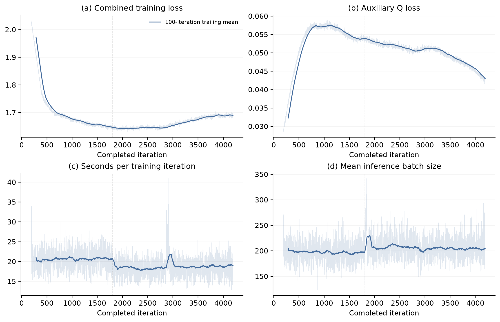

*Figure 6. Online training dynamics. The dashed vertical marker indicates the continuation at iteration 1807. Losses arise from a changing replay distribution and opponent population, so a lower loss is not by itself a strength metric. Timing changes can reflect opponent cost, process behavior, or workload composition.*

Combined loss changes from approximately 2.034 at iteration 187 to 1.690 at iteration 4193, with a non-monotonic trajectory. That behavior is compatible with learning on continually refreshed targets, but the figure does not isolate the effects of architecture, population composition, or learning-rate scheduling.

### 8.2 Championship at iteration 4193

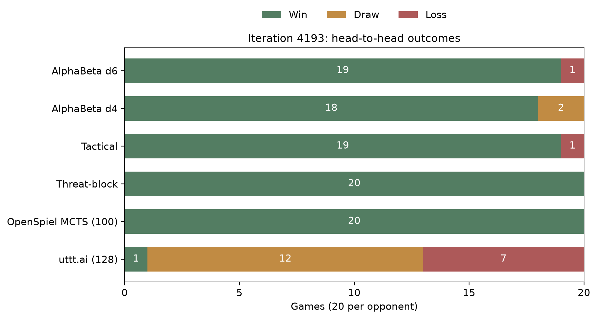

*Figure 7. Candidate outcomes in the later championship. Every bar contains 20 games. Numbers are game counts, and “uttt.ai (128)” and “OpenSpiel MCTS (100)” refer to the integrations and budgets described above.*

**Table 5. Candidate results at iteration 4193.** Score counts draws as half a win. Intervals are report-derived opening-pair bootstrap estimates, not a multiple-comparison significance test.

| Opponent | Wins | Draws | Losses | Score | 95% pair-bootstrap interval |
| --- | ---: | ---: | ---: | ---: | ---: |
| AlphaBeta d6 | 19 | 0 | 1 | 95.0% | 85–100% |
| AlphaBeta d4 | 18 | 2 | 0 | 95.0% | 87.5–100% |
| Tactical | 19 | 0 | 1 | 95.0% | 85–100% |
| Threat-block | 20 | 0 | 0 | 100.0% | 100–100%* |
| OpenSpiel MCTS, 100/decision | 20 | 0 | 0 | 100.0% | 100–100%* |
| uttt.ai stage 2, 128/move | 1 | 12 | 7 | 35.0% | 25–45% |
| **All candidate championship games** | **97** | **14** | **9** | **86.7%** | Not pooled across heterogeneous opponents |

*The degenerate intervals reflect identical scores in the observed sample, not zero uncertainty about future openings.*

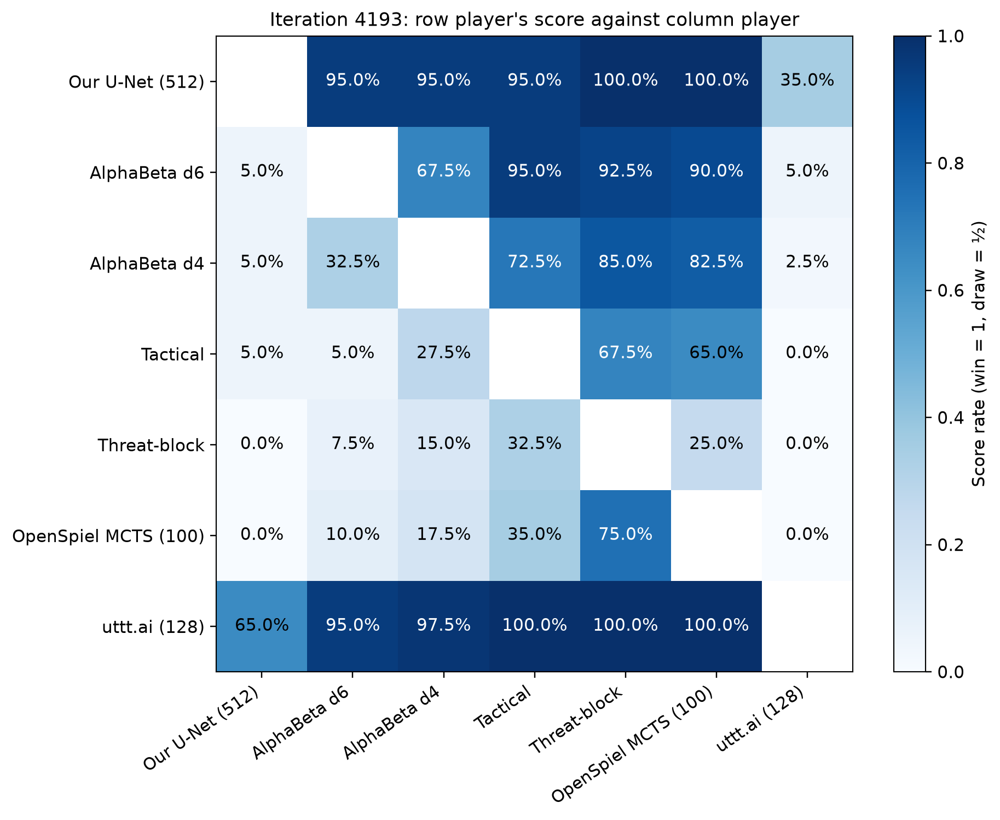

*Figure 8. Full round-robin score matrix. Each off-diagonal cell is the row player's score against the column player. Diagonal entries are undefined. The strong uttt.ai row makes clear that the candidate's dominance over weaker local baselines is not dominance over the strongest entrant.*

The candidate scores well against the tested shallow classical and rollout baselines but loses its direct matchup with uttt.ai. Its 35% score includes twelve draws, one win, and seven losses; reporting only its 65% non-loss rate would hide the direction of the matchup. The saved local Elo estimates rank uttt.ai first at 2260.92 and the candidate second at 2138.07, with AlphaBeta d4 anchored at 1500. These are pool-dependent estimates from the repository's rating implementation. We emphasize direct outcomes rather than treating the rating values as an external strength scale.

### 8.3 Checkpoint comparison and depth-10 AlphaBeta

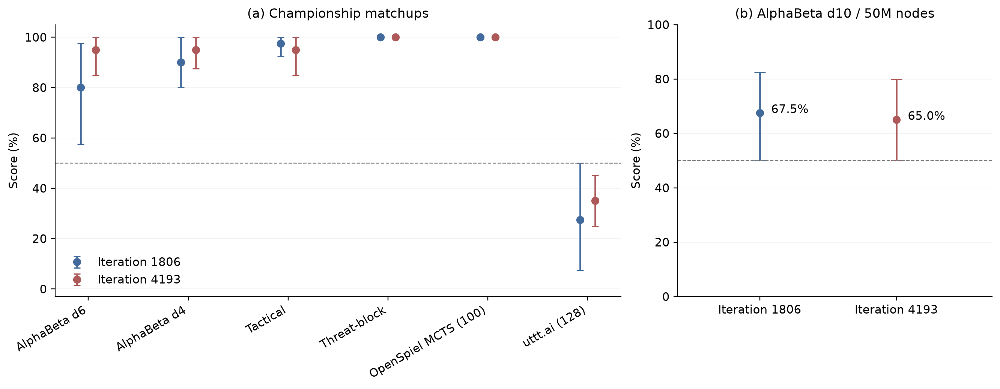

*Figure 9. Scores for iterations 1806 and 4193 with 95% opening-pair bootstrap intervals. Panel (a) compares corresponding championship matchups; panel (b) reports the separate depth-10 experiment. Saturated 100% samples have degenerate empirical intervals. Fixed simulation/depth/node caps do not make this an equal-time comparison.*

**Table 6. Descriptive checkpoint comparison.** Each cell is a score over 20 games against that opponent, using the same nominal evaluation settings.

| Opponent | Iteration 1806 | Iteration 4193 | Difference (percentage points) |
| --- | ---: | ---: | ---: |
| AlphaBeta d6 | 80.0% | 95.0% | +15.0 |
| AlphaBeta d4 | 90.0% | 95.0% | +5.0 |
| Tactical | 97.5% | 95.0% | −2.5 |
| Threat-block | 100.0% | 100.0% | 0.0 |
| OpenSpiel MCTS | 100.0% | 100.0% | 0.0 |
| uttt.ai stage 2 | 27.5% | 35.0% | +7.5 |
| AlphaBeta d10, separate match set | 67.5% | 65.0% | −2.5 |

Against depth-10 AlphaBeta, the earlier candidate records 11 wins, 5 draws, and 4 losses; the later candidate records 9 wins, 8 draws, and 3 losses. Their score intervals are 50–82.5% and 50–80%, respectively. The later score is above 50% in the observed games, but its interval reaches 50%; this is insufficient evidence of a reliable population-level advantage over that opponent. The two point estimates also do not establish a meaningful regression between checkpoints.

Only the 512-simulation arm exists in these selected depth-10 artifacts. Although the harness supports multi-budget sweeps, we cannot draw a search-scaling curve or infer the benefit of 1,024 or 2,000 simulations from a one-arm experiment. The later sweep records 191.514 seconds for 20 games, approximately 9.576 seconds per game. This includes both agents and orchestration; it is not the U-Net's per-move inference latency.

### 8.4 Iteration 4530 evaluation (new)

After the archived evidence above was collected, checkpoint iteration 4530 was evaluated separately, on different hardware and under different conditions, in an enlarged 8-entrant round robin plus a small follow-up spot check. This subsection reports that evaluation on its own terms; it does not replace or get pooled with Sections 8.1–8.3, and its numbers should not be read as a controlled continuation of the iteration-1806/4193 comparison in Section 8.3. Full provenance, source paths, and hashes are in [EVIDENCE.md](EVIDENCE.md#new-evidence-iteration-4530-evaluation).

The candidate is the same U-Net architecture, checkpoint SHA-256 prefix `cb04e705`, at 512 simulations. The roster grew to eight entrants by adding a `cpp-alphabeta-d10` (50-million-node cap) entrant alongside the six opponents used at 1806/4193. The round robin played 72 games per pairing (36 mirrored opening pairs, two-ply openings, seed 17092026) for 2,016 games total, so the candidate itself plays 504 games, not 120.

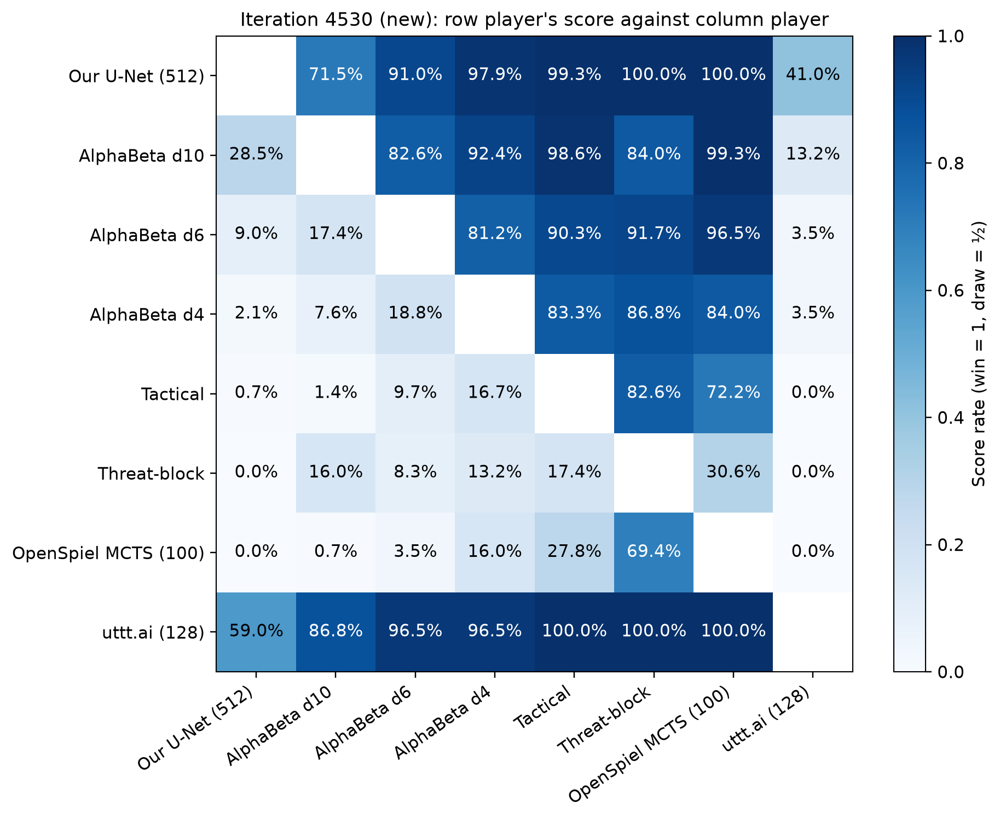

*Figure 10. Iteration-4530 round-robin score matrix, same construction as Figure 8 (row player's score against column player; diagonal undefined), generalized here to an eight-entrant roster.*

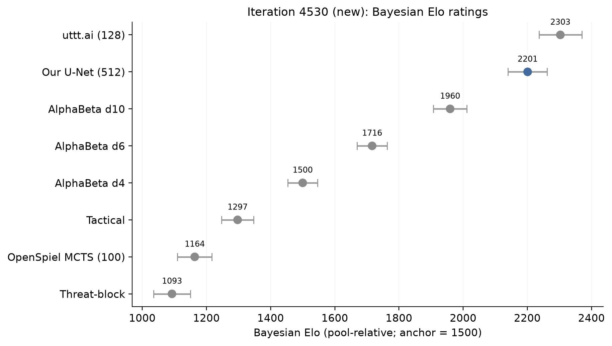

*Figure 11. Saved Bayesian-Elo ratings for the iteration-4530 championship, one point per entrant with its reported 95% CI. These are pool-relative ratings from this repository's rating implementation, anchored at AlphaBeta d4 = 1500, not an external or universal scale.*

**Table 8. Candidate results at iteration 4530.** 72 games per opponent; score counts a draw as half a win. Intervals are report-derived opening-pair bootstrap estimates (seed 4243), not a multiple-comparison significance test.

| Opponent | Wins | Draws | Losses | Score | 95% pair-bootstrap interval |
| --- | ---: | ---: | ---: | ---: | ---: |
| AlphaBeta d10 | 46 | 11 | 15 | 71.5% | 63.9–79.2% |
| AlphaBeta d6 | 63 | 5 | 4 | 91.0% | 85.4–95.8% |
| AlphaBeta d4 | 70 | 1 | 1 | 97.9% | 94.4–100% |
| Tactical | 71 | 1 | 0 | 99.3% | 97.9–100% |
| Threat-block | 72 | 0 | 0 | 100.0% | 100–100%* |
| OpenSpiel MCTS, 100/decision | 72 | 0 | 0 | 100.0% | 100–100%* |
| uttt.ai stage 2, 128/move | 9 | 41 | 22 | 41.0% | 35.4–46.5% |
| **All candidate championship games** | **403** | **59** | **42** | **85.8%** | Not pooled across heterogeneous opponents |

*The degenerate intervals reflect identical scores in the observed sample, not zero uncertainty about future openings.*

By the saved leaderboard, the integrated uttt.ai finishes first (91.3% score, Bayesian Elo 2303.0), the candidate second (85.8% score, Elo 2201.0), and AlphaBeta d10 third (71.2% score, Elo 1959.5). As at iteration 4193, the candidate dominates the shallower classical and rollout baselines but does not close the gap to uttt.ai; its pair-score against uttt.ai specifically is 41.0% (95% CI 35.4–46.5%), close to but not directly comparable with the 4193 championship's 35.0% given the different roster, opening corpus, and hardware conditions described below.

A follow-up 20-game check ran the same iteration-4530 checkpoint against `utttai-128` at 2,000 simulations instead of 512 (seed 17098026): 4 wins, 8 draws, 8 losses, a 40.0% score (95% pair-bootstrap CI 25.0–55.0%, ten opening pairs). This is not a controlled comparison against the 512-simulation result above — see caveat 3 below.

This subsection's evidence carries caveats that do not apply to Sections 8.1–8.3:

1. **Not equal-time or equal-compute.** Neither the championship nor the spot check equalizes wall-clock time or hardware cost across entrants; fixed simulation/depth/node budgets are reported as configured, not as matched computation.
2. **Concurrent with training.** The championship ran under reduced CPU priority (`nice -n 10`) on the same remote host as an active training job, not on isolated hardware, so its timing reflects that contention.
3. **The 2,000-simulation spot check is underpowered for a budget comparison.** Twenty games is too small a sample to conclude that 2,000 simulations are no stronger than 512; its 40.0% score must not be read against the championship's 41.0% candidate-vs-uttt.ai pair-score as though the two experiments were a matched pair — they differ in opening corpus, sample size, and concurrent load.
4. **A single integration's result, not a field-wide claim.** uttt.ai finishing ahead of the candidate in this pool means this specific integration, at this budget, scored higher here; it is not evidence that uttt.ai is the strongest Ultimate Tic-Tac-Toe engine that exists.
5. **No full move sequences.** The saved game records for this evaluation preserve openings, seat assignments, and outcomes, not complete move-by-move trajectories.

## 9. Discussion, limitations, and future experiments

The strongest supported conclusion is that the implemented system trains and evaluates a competitive local agent, with good results against the selected non-neural baselines and a measurable remaining gap to the integrated uttt.ai model. This pattern holds across both evaluated checkpoints reported here, the archived iteration 4193 (Section 8.2) and the newer iteration 4530 (Section 8.4), under two evaluation setups that differ in roster size, opening corpus, and hardware conditions; it is not evidence of a trend fit across those two points. The evidence is narrower than a claim that any one architectural component is responsible.

The present study has the following limitations:

1. **Small samples and repeated openings.** Ten opening pairs per matchup provide limited coverage in the archived 4193 evaluation and in the iteration-4530 spot check; the iteration-4530 championship itself uses a larger 36-pair corpus per matchup but still one fixed corpus. The same corpora can be overused during development. Future evaluations need larger, held-out opening sets and multiple seeds.
2. **Unequal compute.** Neural MCTS, rollout MCTS, and AlphaBeta have different costs. Equal simulation counts are not equal computation; here the counts are not even equal, and the iteration-4530 championship additionally ran concurrently with an active training job under reduced CPU priority, adding further timing noise. A separate wall-time-controlled study is needed.
3. **Training overlap with evaluation families.** uttt.ai, OpenSpiel, and AlphaBeta appear in the curriculum. The results do not measure transfer to wholly unseen opponent families.
4. **No controlled ablations.** We do not know the isolated contribution of Q regression, GroupNorm, residual depth, population quotas, proof propagation, subtree reuse, or bootstrap initialization.
5. **Historical provenance gaps.** Checkpoint hashes are preserved, but exact historical dependency versions, all entrant defaults, complete hardware identity, and early training lineage are not fully attested. Current code inspection is not proof of byte-identical historical execution.
6. **Depth is a cap.** AlphaBeta has both depth and node limits. Without per-move telemetry, a depth-10 configuration does not prove that every move completed a full depth-10 search.
7. **Validation dependence.** Bootstrap holdout rows can share game trajectories with training rows. Future splits should operate by game, and ideally by opening family.
8. **Architecture and workload scope.** This is one game variant with a fixed 81-action representation. Native state sizes and kernel benchmarks do not establish general-purpose or end-to-end speed superiority.

A useful next experimental sequence would first fix stronger provenance and held-out evaluation, then compare multiple independently trained seeds. With that foundation, controlled ablations could compare MLP, residual MLP, and hierarchical convolution at matched training budgets; disable Q supervision; vary self-play versus mixed-population shares; and test search reuse/pruning independently. Against uttt.ai, compare a range of both simulation and wall-time budgets while keeping model versions and openings fixed.

A browser frontend and Docker packaging were discussed as future work but are not implemented research contributions of the inspected repository. Automated device selection for a future application, broad GPU-vendor support, and production deployment should likewise remain outside the reported experimental claims until implemented and tested.

## 10. Reproducibility and repository map

### 10.1 Rebuild the report figures

The report package contains the manuscript, PNG and editable SVG plots, normalized evidence, source hashes, a configuration file, and the image-generation record. The reusable renderer lives under `scripts/` in accordance with the repository's script policy.

```bash
# Reproduce charts and flowcharts solely from the bundled evidence.
python scripts/report_figures.py \
  --snapshot docs/report/evidence/snapshot.json \
  --output docs/report

# Refresh evidence from the run paths selected in the configuration.
# This rewrites the report snapshot and measured figures; review the paper afterward.
python scripts/report_figures.py \
  --config docs/report/report-config.json \
  --output docs/report
```

The renderer uses NumPy and Matplotlib, validates per-game totals against the saved matrix and ratings, and reproduces saved depth-10 confidence intervals. It does not load checkpoint tensors, start games, or use the GPU. The imagegen methodology figure is separately persisted in `figures/methodology.png`; rebuilding measured charts does not regenerate it. Detailed asset provenance is in [EVIDENCE.md](EVIDENCE.md) and [figure-prompts.md](figure-prompts.md).

### 10.2 Reproduce new training and evaluation runs

Use the current guides for environment setup and dependency installation. These commands create **new experiments**; they do not recover deleted historical checkpoints or guarantee the same result on a different software stack.

```bash
python -m sttt.ai generate-dataset \
  --output data/bootstrap-new --games 50000 --workers 8

python -m sttt.ai pretrain \
  --dataset data/bootstrap-new --output runs/bootstrap-new \
  --arch unet --epochs 10 --batch 1024 --device cuda --fp16

scripts/train.sh \
  --checkpoint runs/bootstrap-new/latest.pt \
  --output runs/online-new \
  --population-config configs/population/baseline.json

scripts/evaluate.sh \
  --checkpoint runs/online-new/latest.pt \
  --output runs/evaluation-new \
  --budgets "512" --opponent-depth 10 --opponent-nodes 50000000
```

**Table 7. Where the implementation lives.**

| Concern | Source |
| --- | --- |
| Game rules and state transitions | [`sttt/env.py`](../../sttt/env.py) |
| Encoding, model factory, and loss | [`sttt/learning.py`](../../sttt/learning.py) |
| Hierarchical network | [`sttt/unet.py`](../../sttt/unet.py) |
| Reference search and Q targets | [`sttt/search.py`](../../sttt/search.py) |
| Native state/search and bindings | [`cpp/`](../../cpp/), [`sttt/cpp_env.py`](../../sttt/cpp_env.py) |
| Worker pool and inference owner | [`sttt/selfplay.py`](../../sttt/selfplay.py) |
| Offline dataset generation/pretraining | [`sttt/bootstrap.py`](../../sttt/bootstrap.py) |
| Online training, replay, and checkpoints | [`sttt/ai.py`](../../sttt/ai.py) |
| Population definitions and augmentation | [`sttt/population.py`](../../sttt/population.py), [`configs/population/`](../../configs/population/) |
| Optional replay stratification | [`sttt/replay_sampling.py`](../../sttt/replay_sampling.py) |
| Opponents and external engine adapters | [`sttt/bots.py`](../../sttt/bots.py), [`sttt/utttai_wrapper.py`](../../sttt/utttai_wrapper.py) |
| Pairing, ratings, and evidence manifests | [`sttt/tournament.py`](../../sttt/tournament.py), [`sttt/evaluation.py`](../../sttt/evaluation.py) |
| Generalized operational tools | [`scripts/`](../../scripts/) |
| Correctness and integration tests | [`tests/`](../../tests/), [test guide](../testing.md) |

### 10.3 Verification performed for this report

The report-generation workflow checks every preserved championship matchup against its raw game rows, compares row totals with the saved ratings, verifies two games per opening pair, and reproduces both saved depth-10 bootstrap intervals. Figures are rendered from those validated records and inspected for readability. Local Markdown links and figure references are checked before handoff. These checks validate the reporting pipeline; they are not a new certification of the full training or external-engine stack. The same checks were re-run after adding the iteration-4530 evidence in Section 8.4, confirming that the archived iteration-1806/4193 data was carried forward unchanged (see [EVIDENCE.md](EVIDENCE.md#integrity-checks-and-uncertainty)).

## 11. Conclusion

The repository implements a complete experimental pipeline for hierarchical neural search in Ultimate Tic-Tac-Toe: exact rules, compact native search, policy/value/Q learning, population game generation, resumable training, and paired evaluation. Its saved results, at both the archived iteration 4193 and the newer iteration 4530, show strong local baseline performance while uttt.ai remains the strongest tested championship entrant in every evaluated pool; the iteration-4530 championship additionally ran under unequal, concurrently-loaded compute, so it sharpens the qualitative picture without licensing a stronger quantitative claim than the archived evidence already supported. The main research opportunity is now controlled measurement: broader held-out evaluation, equal-time comparisons, stronger provenance, and ablations that determine which components produce reliable gains.

## References

1. Knuth, D. E., and Moore, R. W. (1975). *An analysis of alpha-beta pruning*. Artificial Intelligence, 6(4), 293–326. [Publisher](https://www.sciencedirect.com/science/article/pii/0004370275900193).
2. Kocsis, L., and Szepesvári, C. (2006). *Bandit Based Monte-Carlo Planning*. ECML, 282–293. [Paper](https://aima.cs.berkeley.edu/~russell/classes/cs294/s11/readings/Kocsis%2BSzepesvari:2006.pdf).
3. Silver, D., et al. (2017). *Mastering Chess and Shogi by Self-Play with a General Reinforcement Learning Algorithm*. arXiv:1712.01815. [Paper](https://arxiv.org/abs/1712.01815).
4. Ronneberger, O., Fischer, P., and Brox, T. (2015). *U-Net: Convolutional Networks for Biomedical Image Segmentation*. arXiv:1505.04597. [Paper](https://arxiv.org/abs/1505.04597).
5. He, K., Zhang, X., Ren, S., and Sun, J. (2015). *Deep Residual Learning for Image Recognition*. arXiv:1512.03385. [Paper](https://arxiv.org/abs/1512.03385).
6. Wu, Y., and He, K. (2018). *Group Normalization*. arXiv:1803.08494. [Paper](https://arxiv.org/abs/1803.08494).
7. Waczynski, A. *uttt.ai: AlphaZero-like AI solution for playing Ultimate Tic-Tac-Toe in the browser*. [Repository](https://github.com/arnowaczynski/utttai); pinned local revision and model checksum in [PROVENANCE.md](../../engines/vendor/utttai/PROVENANCE.md).
8. Lanctot, M., et al. (2019). *OpenSpiel: A Framework for Reinforcement Learning in Games*. arXiv:1908.09453. [Paper](https://arxiv.org/abs/1908.09453).
9. Google DeepMind. *OpenSpiel documentation and source*. [Overview](https://openspiel.readthedocs.io/en/latest/intro.html), [Ultimate Tic-Tac-Toe implementation](https://github.com/google-deepmind/open_spiel/blob/master/open_spiel/games/ultimate_tic_tac_toe/ultimate_tic_tac_toe.cc), [MCTS implementation](https://github.com/google-deepmind/open_spiel/blob/master/open_spiel/python/algorithms/mcts.py).

External sources were consulted on 17 September 2026. Dynamic upstream pages describe their own projects; exact local integration details are tied to the repository files and the preserved experiment evidence, not assumed from a moving upstream branch.
